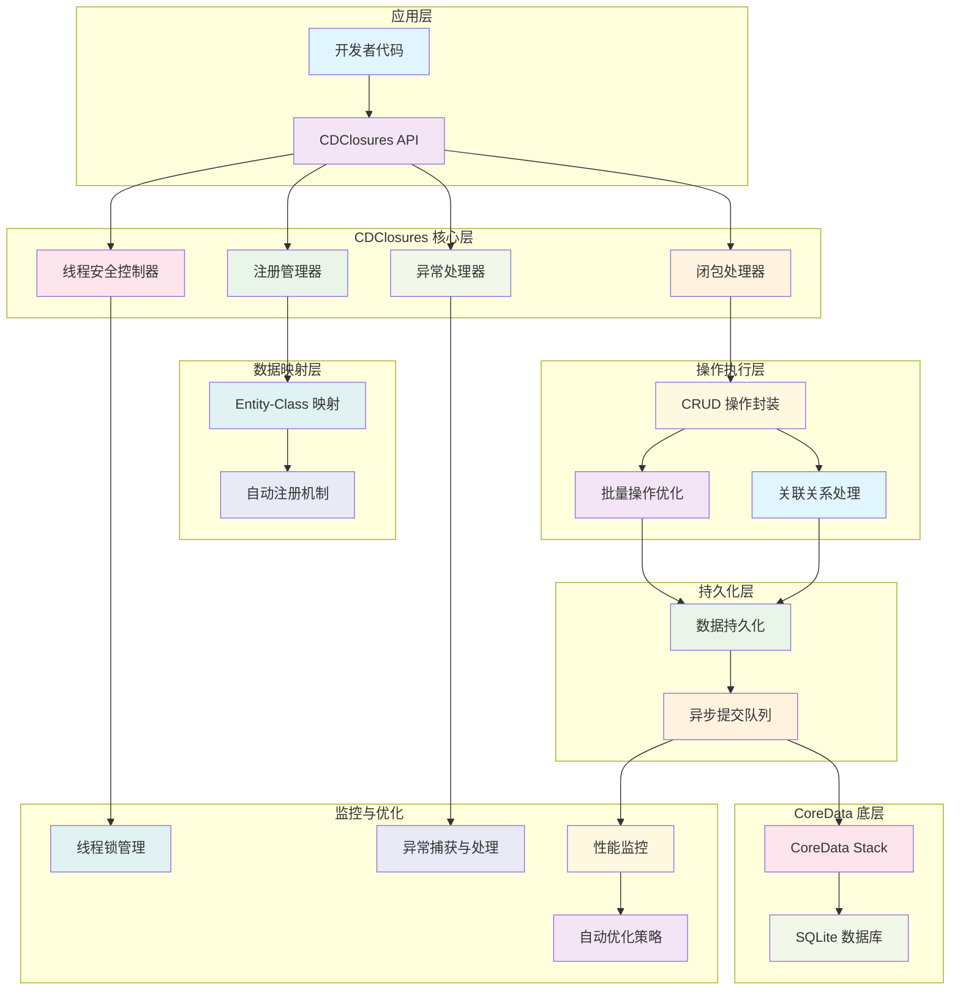

# CDClosures

[](https://travis-ci.org/youlianchun/CDClosures)
[](https://cocoapods.org/pods/CDClosures)
[](https://cocoapods.org/pods/CDClosures)
[](https://cocoapods.org/pods/CDClosures)

CDClosures 是一个专为 iOS 开发者设计的 CoreData 操作封装库，通过闭包语法简化 CoreData 的复杂操作，提供更加友好和高效的数据库操作体验。

## 功能特性

### 🚀 核心功能
- **高频操作数据同步优化** - 针对频繁的数据库操作进行性能优化
- **极端条件处理** - 处理 kill、APP 后台、崩溃等异常情况下的数据同步
- **并发控制** - 内置线程安全机制，确保多线程环境下的数据一致性
- **异常捕获** - 精确捕获和处理操作异常信息

### 🔧 技术特性
- **自动注册** - 关联 xcdatamodeld 实现 model 自动注册
- **操作绑定** - 实现 model 与数据库操作的自动绑定
- **API 兼容** - 兼容 CoreData 不同版本的 API
- **友好接入** - 相比 CoreData 原生 API 更加易用

## 核心技术原理框架



### 架构说明

**🔹 应用层**：开发者通过简洁的闭包语法调用 CDClosures API

**🔹 核心层**：包含注册管理、闭包处理、线程控制、异常处理等核心功能模块

**🔹 映射层**：自动建立 CoreData Entity 与 Swift Class 的映射关系

**🔹 执行层**：封装 CRUD 操作，支持批量处理和关联关系处理

**🔹 持久化层**：数据持久化与异步提交队列管理

**🔹 底层**：基于 CoreData Stack 和 SQLite 数据库

**🔹 监控层**：线程安全、异常处理、性能监控和自动优化

## 工作原理

### 架构设计
CDClosures 采用闭包模式封装 CoreData 操作，通过以下机制实现功能：

1. **注册机制** - 通过 `registerCDClosures()` 方法注册 CoreData 文件，自动建立 Entity 与 Class 的映射关系
2. **闭包封装** - 将复杂的 CoreData 操作封装在闭包中，简化调用方式
3. **异步提交** - 在更新操作后 0.2s 内无其他更新或 APP 进入后台时，自动进行异步提交
4. **线程安全** - 内置线程锁机制，防止并发操作冲突

### 数据流程
```
注册 CoreData → 建立映射关系 → 闭包操作 → 数据持久化 → 异步提交
```

## 使用示例

### 基础设置
```swift
// 第一步：注册 CoreData 文件
do {
    try registerCDClosures("data") // 注册 data.xcdatamodeld 文件
} catch {
    print("注册失败：\(error)")
}
```

### 数据模型
假设您的 `data.xcdatamodeld` 包含以下模型：
- `Info` { title: String?, message: String? }
- `Model` { idx: Int32, time: Date?, info: Info? }

### 增删改查操作

#### 插入数据
```swift
// 插入单条数据
try Info.insert { info in
    info.title = "标题"
    info.message = "消息内容"
}

// 批量插入数据
try Model.insert(count: 100) { (idx, model) in
    model.idx = Int32(idx)
    model.time = Date()
}

// 插入关联数据
var info: Info?
try Info.insert { i in
    i.title = "关联标题"
    i.message = "关联消息"
    info = i
}

try Model.insert { model in
    model.idx = 101
    model.time = Date()
    model.info = info // 设置关联关系
}
```

#### 删除数据
```swift
// 删除指定条件的数据
try Model.delete(where: "idx = 3")

// 删除所有数据
try Model.delete()
```

#### 更新数据
```swift
// 更新指定条件的数据
try Model.update(where: "idx = 4") { model in
    model.time = Date()
}
```

#### 查询数据
```swift
// 分页查询并排序
try Model.select(range: (10, 10), sorts: [("time", .asc)]) { models in
    for model in models {
        print("索引: \(model.idx), 时间: \(model.time ?? Date())")
    }
}
```

## 注意事项

### ⚠️ 重要提醒
1. **异常处理** - CDClosures 采用 `throws` 进行异常传递，请使用 `do-catch` 进行捕获
2. **嵌套限制** - 同一个 CDClosures 的闭包之间禁止嵌套使用，避免死锁
3. **异步提交** - 更新操作后 0.2s 内无其他更新或 APP 进入后台时，会自动进行异步提交
4. **唯一映射** - 每个 Entity 和 Class 的对应关系必须是唯一的
5. **批处理延迟** - 批处理操作会先将内容持久化，存在一定延迟

## 安装方式

### CocoaPods
CDClosures 可通过 [CocoaPods](https://cocoapods.org) 安装，在您的 Podfile 中添加：

```ruby
pod 'CDClosures'
```

然后运行：
```bash
pod install
```

## 作者信息

**youlianchun** - [youlianchunios@163.com](mailto:youlianchunios@163.com)

## 开源协议

CDClosures 基于 MIT 协议开源，详情请查看 [LICENSE](LICENSE) 文件。
